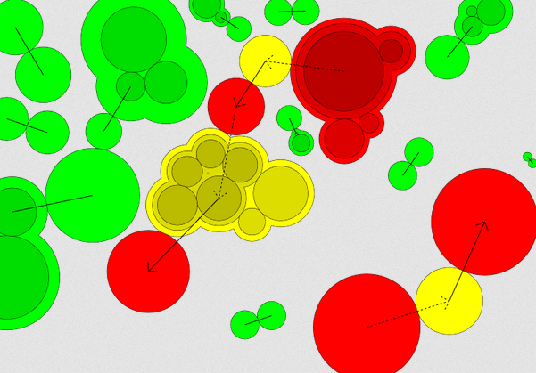

# Matching Example

# Building

If you want to modify this project, here is how you get the code and turn your changes into working html/javascript.

1. Have [git](https://git-scm.com/) and [Node.js](https://nodejs.org/en/download/) installed.

2. Clone the repository.

    `git clone https://github.com/Strilanc/SurfaceCodeTurnTable.git`

3. Install the dev dependencies.

    `cd SurfaceCodeTurnTable`

    `npm install`

4. (*Optional*) Make your changes. Run the tests.

    `npm run test-firefox`

5. Build the output.

    `npm run build`

6. The output is a single html file `out/main.html`. Confirm it works by opening it with a web browser.

    `firefox out/main.html`

7. Copy `out/main.html` to wherever you want.
